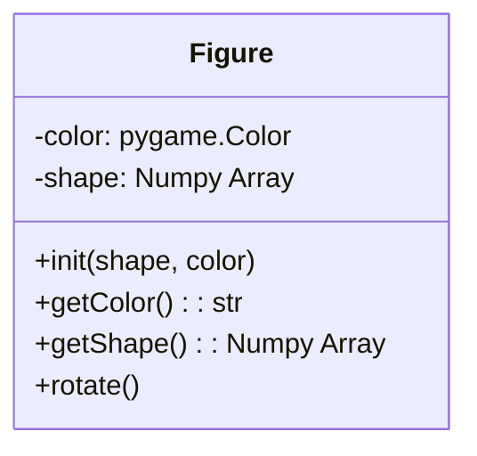

```mermaid
classDiagram
    class Figure {
        -color: pygame.Color    
        -shape: Numpy Array
        +init(shape, color)
        +getColor(): str
        +getShape(): Numpy Array 
        +rotate()
    }
```